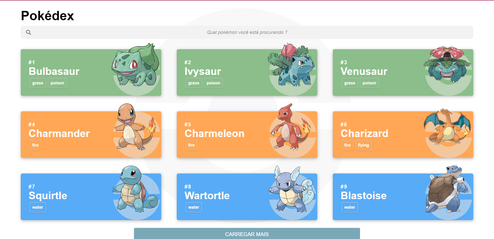

<p align="center">
  
</p>

<p align="center" fontSize="60px">
  Plataforma para listagem de pokémons
</p>

<p align="center">
  
</p>

## 💻 Projeto

Desenvolver uma plataforma web para listagem e visualização de pokémons, para a construção deste projeto foi usado ReactJS. Todos os dados sobre os pokémons como nome, número, tipo, imagem e entre outras coisas, foram possíveis com o uso da API REST [PokéApi](https://pokeapi.co/).

Esse projeto é uma inspiração de um app mobile sobre pokémons, tal [layout](https://www.behance.net/gallery/95727849/Pokdex-App) foi criado a partir de um desafio proposto pela equipe do [umpontoseis](https://umpontoseis.com/).

### Funcionalidades

- [x] **Listagem dos pokémons**: Listar os pokémons com o uso da API REST.

- [x] **Ampliar a listagem dos pokémons**: Método para adicionar mais pokémons a lista, ampliando-se a quantia de pokémons mostrada ao usuário.

- [x] **Buscar pokémons**: Método para filtrar os pokémons a partir do seu nome.

- [ ] **Efeito no cartão do pokémon**: Criar uma animação ao usuário apresentar foco no cartão do pokémon.

- [ ] **Selecionar pokémon**: Criar uma página na aplicação com mais detalhes sobre o pokémon escolhido.

- [ ] **Criar seções do pokémons**: Separar as informações do pokémon em três seções: Sobre, Estatísticas, Evoluções.

- [ ] **Seção Sobre**: Dados básicos sobre o pokémon, como altura, peso, fraquezas.

- [ ] **Seção Estatísticas**: Pontos de batalha do pokémon, como vida, ataque, defesa, velocidade, especial ataque e especial defesa.

- [ ] **Seção Evoluções**: Construir a árvore de evolução do pokémon.

## :rocket: Tecnologias

-  [React](https://pt-br.reactjs.org/)
-  [Styled-components](https://www.styled-components.com/)
-  [React-Icons](https://react-icons.netlify.com/)
-  [Axios](https://github.com/axios/axios)
-  [React Router](https://reactrouter.com/web/guides/quick-start)
-  [TypeScript](https://www.typescriptlang.org/)

## 📥 Instalação e execução

Faça um clone desse repositório e acesse o diretório.

```bash
$ git clone git@github.com:RaulSAraujo/pokedex.git && cd pokedex
```

```bash
# Instalando as dependências
$ yarn

# Executanto aplicação
$ yarn start

```

## :muscle: Contribuir

Faça o `fork` e clone o projeto a partir do seu usuário.

```bash
# Clonando projeto
$ git clone https://github.com/RaulSAraujo/pokedex.git

# Criando um branch
$ git branch minha-alteracao

# Acessando o novo branch
$ git checkout -b minha-alteracao

# Adicionando os arquivos alterados
$ git add .

# Criando commit e a mensagem
$ git commit -m "Corrigindo...."

# Enviando alterações para o brach
$ git push origin minha-alteracao
```
Você deve navegar até o seu repositório onde fez o fork e clicar no botão *New pull request* no lado esquerdo da página.

## 📝 Licença

Esse projeto está sob a licença MIT. Veja o arquivo [LICENSE](LICENSE.md) para mais detalhes.
